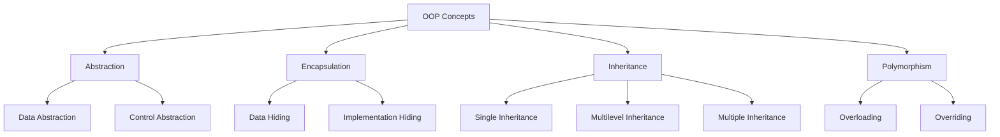
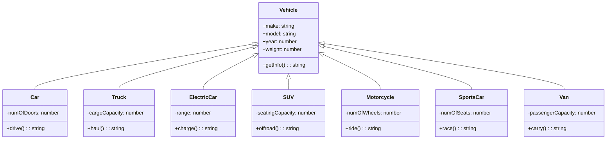

# :exclamation: Preview Version

---

<div align="center">

</div>

---

```js
console.log('Welcome here');
```

---

<div align="center">

</div>

---

<div align="center">

</div>

<div align="center">

</div>

---

## :earth_asia: Public repositories on my Github profile are primarily for hobby and practice purposes. If you are looking for real-world projects, please do not hesitate to contact me

##  Github profilimdeki genel depolar öncelikle hobi ve pratik amaçlar için hizmet vermektedir. Gerçek dünya projeleri arıyorsanız, lütfen benimle iletişime geçmekten çekinmeyin

---

<pre>
            __           _ _               _ _   _           _
           / _|         | (_)  ____       (_) | | |         | |
_____ _| |_ ___ ___| |_/ __ \  ___ _| |_| |___   _| |__  
/ __|/ _` |  _/ _` | '__| | |/ /_` |/ _` | | __| '_ \| | | | '_ \
\__ \ (_| | || (_| | |  | | | | (_| | (_| | | |_| | | | |_| | |_) |
|___/\__,_|_| \__,_|_|  |_|_|\ \__,_|\__, |_|\__|_| |_|\__,_|_.__/
                              \____/  __/ |
                                     |___/
</pre>

:computer: Dealing with Computers, since 2004

---

## Currently Using

<div>


</div>

<div>


</div>

<div>


</div>

<div>


</div>

<div>


</div>

## I've knowledge of

<table><tr><td valign="top" width="33%">

### Frontend

<div align="center">  
<a href="https://reactjs.org/" target="_blank"></a>  
<a href="https://getbootstrap.com/docs/3.4/javascript/" target="_blank"></a>  
<a href="https://www.w3schools.com/css/" target="_blank"></a>  
<a href="https://en.wikipedia.org/wiki/HTML5" target="_blank"></a>  
<a href="https://www.electronjs.org/" target="_blank"></a>  
<a href="https://www.javascript.com/" target="_blank"></a>  
<a href="https://www.typescriptlang.org/" target="_blank"></a>  
<a href="https://www.adobe.com/in/products/illustrator.html" target="_blank"></a>  
<a href="https://www.chartjs.org/" target="_blank"></a>  
<a href="https://webpack.js.org/" target="_blank"></a>  
<a href="http://getbem.com/" target="_blank"></a>  
<a href="https://www.tailwindcss.com/" target="_blank"></a>  
<a href="https://styled-components.com/" target="_blank"></a>  
<a href="https://www.adobe.com/in/products/photoshop.html" target="_blank"></a>  
<a href="https://nextjs.org/" target="_blank"></a>  
<a href="https://sass-lang.com/" target="_blank"></a>  
<a href="https://www.adobe.com/in/products/aftereffects.html" target="_blank"></a>  
<a href="https://www.adobe.com/products/photoshop-lightroom.html" target="_blank"></a>  
<a href="https://www.adobe.com/in/products/premiere.html" target="_blank"></a>  
</div>

</td><td valign="top" width="33%">

### Backend

<div align="center">  
<a href="https://www.javascript.com/" target="_blank"></a>  
<a href="https://www.typescriptlang.org/" target="_blank"></a>  
<a href="https://www.mongodb.com/" target="_blank"></a>  
<a href="https://nodejs.org/" target="_blank"></a>  
<a href="https://www.nginx.com/" target="_blank"></a>  
<a href="https://www.python.org/" target="_blank"></a>  
<a href="https://expressjs.com/" target="_blank"></a>  
<a href="https://docs.microsoft.com/en-us/dotnet/csharp/" target="_blank"></a>  
<a href="https://dotnet.microsoft.com/download/dotnet-framework" target="_blank"></a>  
<a href="https://www.cprogramming.com/" target="_blank"></a>  
<a href="https://www.raspberrypi.org/" target="_blank"></a>  
<a href="https://go.dev/" target="_blank"></a>  
<a href="https://www.android.com/intl/en_in/" target="_blank"></a>  
<a href="https://www.rust-lang.org/" target="_blank"></a>  
<a href="https://www.postgresql.org/" target="_blank"></a>  
<a href="https://www.arduino.cc/" target="_blank"></a>  
</div>

</td><td valign="top" width="33%">

### DevOps

<div align="center">  
<a href="https://aws.amazon.com/" target="_blank"></a>  
<a href="https://cloud.google.com/" target="_blank"></a>  
<a href="https://kubernetes.io/" target="_blank"></a>  
<a href="https://www.linux.org/" target="_blank"></a>  
<a href="https://github.com/" target="_blank"></a>  
<a href="https://www.gnu.org/software/bash/" target="_blank"></a>  
<a href="https://www.meteor.com/" target="_blank"></a>  
<a href="https://www.chartjs.org/" target="_blank"></a>  
<a href="https://firebase.google.com/" target="_blank"></a>  
<a href="https://about.gitlab.com/" target="_blank"></a>  
<a href="https://www.jestjs.io/" target="_blank"></a>  
<a href="https://docs.microsoft.com/en-us/powershell/" target="_blank"></a>  
<a href="https://powerbi.microsoft.com/en-us/" target="_blank"></a>  
<a href="https://webpack.js.org/" target="_blank"></a>  
<a href="https://www.terraform.io/" target="_blank"></a>  
<a href="https://kafka.apache.org/" target="_blank"></a>  
<a href="https://www.ansible.com/" target="_blank"></a>  
<a href="https://www.elastic.co/" target="_blank"></a>  
<a href="https://www.docker.com/" target="_blank"></a>  
<a href="https://www.rabbitmq.com/" target="_blank"></a>  
</div>

</td></tr></table>

<br/>

## Statistics


## My daily.dev DevCard

<a href="https://app.daily.dev/safarli"></a>

---

<br>

## :large_blue_circle: Common terms for different stages of software testing and development

<table><thead><tr><th>Term</th><th>Definition</th></tr></thead><tbody><tr><td>🏗️ Development build</td><td>A version of the software that is built for testing and debugging purposes during the development process. It may not have all the features or be completely stable, but it is used to test new code changes.</td></tr><tr><td>🐝 Beta version</td><td>A pre-release version of the software that is made available to a limited group of users to test and provide feedback on before the final release. This version is usually more stable than a development build, but may still have some bugs.</td></tr><tr><td>🚀 Release candidate</td><td>A version of the software that is considered to be almost ready for release, but still needs some final testing and bug fixing before it is released to the public. It is typically used for testing with a larger group of users.</td></tr><tr><td>🐣 Alpha version</td><td>An early version of the software that is released to a limited group of users for testing and feedback. It may have limited functionality and contain many bugs.</td></tr><tr><td>🔍 Preview version</td><td>A version of the software that is made available to users to preview new features or changes that are coming in a future release. It is typically more stable than an alpha version, but may still have some bugs.</td></tr></tbody></table>

<br>

## :large_blue_circle: Componets of a computer

<table><thead><tr><th>Component</th><th>Function</th><th>Example</th></tr></thead><tbody><tr><td>💾 Hard Disk Drive (HDD)</td><td>Stores data long-term</td><td>Seagate Barracuda, Western Digital Black</td></tr><tr><td>💻 Central Processing Unit (CPU)</td><td>Executes instructions and performs calculations</td><td>Intel Core i9, AMD Ryzen 9</td></tr><tr><td>🖥️ Graphics Processing Unit (GPU)</td><td>Renders images and videos</td><td>Nvidia GeForce RTX 3080, AMD Radeon RX 6800 XT</td></tr><tr><td>📶 Network Interface Card (NIC)</td><td>Connects a computer to a network</td><td>Intel Ethernet Connection, Realtek PCIe Gigabit Ethernet</td></tr><tr><td>🎧 Audio Card</td><td>Processes and outputs audio</td><td>Creative Sound Blaster Z, Asus Xonar Essence STX</td></tr><tr><td>🖨️ Printer</td><td>Outputs physical copies of digital documents</td><td>HP LaserJet, Canon PIXMA</td></tr><tr><td>📹 Webcam</td><td>Captures video and audio</td><td>Logitech C920, Razer Kiyo</td></tr><tr><td>🕹️ Input Devices</td><td>Allow user to interact with the computer</td><td>Keyboard, Mouse, Game Controller</td></tr><tr><td>🖥️ Display</td><td>Outputs visual information from computer</td><td>Dell UltraSharp, LG OLED</td></tr><tr><td>🔋 Power Supply Unit (PSU)</td><td>Supplies power to computer components</td><td>Corsair RM850x, EVGA SuperNOVA 750 G5</td></tr></tbody></table>

<br>

## :large_blue_circle: Main components and modules of the Linux kernel

<table>
  <thead>
    <tr>
      <th>Component/Module</th>
      <th>Description</th>
    </tr>
  </thead>
  <tbody>
    <tr>
      <td>:running: Process Management</td>
      <td>Manages the creation, execution, and termination of processes</td>
    </tr>
    <tr>
      <td>:memo: Memory Management</td>
      <td>
        Allocates and deallocates memory for processes and manages virtual
        memory
      </td>
    </tr>
    <tr>
      <td>:file_folder: Filesystem Management</td>
      <td>
        Provides an interface between the kernel and the file system, manages
        file permissions and handles file system requests
      </td>
    </tr>
    <tr>
      <td>:computer_mouse: Device Drivers</td>
      <td>
        Provide an interface between hardware devices and the kernel, allowing
        the kernel to communicate with the hardware
      </td>
    </tr>
    <tr>
      <td>:globe_with_meridians: Network Stack</td>
      <td>Implements network protocols and manages network connections</td>
    </tr>
    <tr>
      <td>:lock: Security</td>
      <td>
        Implements security measures such as access control and authentication
      </td>
    </tr>
    <tr>
      <td>:alarm_clock: Scheduler</td>
      <td>
        Determines which processes are executed by the CPU and for how long
      </td>
    </tr>
    <tr>
      <td>:computer: Virtualization</td>
      <td>
        Implements virtualization technologies to allow multiple operating
        systems to run on a single physical machine
      </td>
    </tr>
    <tr>
      <td>:speech_balloon: Inter-Process Communication</td>
      <td>
        Provides mechanisms for processes to communicate with each other, such
        as pipes and sockets
      </td>
    </tr>
  </tbody>
</table>

<br>

## :large_blue_circle: Here are some of the most common programming paradigms

<table><thead><tr><th>:computer: Programming Paradigm</th><th>:memo: Description</th></tr></thead><tbody><tr><td><strong>Imperative Programming</strong></td><td>Programming based on giving the computer a set of instructions to follow in order to accomplish a task.</td></tr><tr><td><strong>Declarative Programming</strong></td><td>Programming based on describing the problem to be solved, rather than providing step-by-step instructions.</td></tr><tr><td><strong>Functional Programming</strong></td><td>Programming based on writing functions that are designed to perform specific tasks, with little or no emphasis on the flow of control within the program.</td></tr><tr><td><strong>Object-Oriented Programming (OOP)</strong></td><td>Programming based on the use of objects that encapsulate data and functionality together, with an emphasis on abstraction, inheritance, and polymorphism.</td></tr><tr><td><strong>Event-Driven Programming</strong></td><td>Programming based on responding to events, such as user input, network messages, or timer events.</td></tr><tr><td><strong>Procedural Programming</strong></td><td>Programming similar to imperative programming, but with a focus on using procedures or functions to group related code together.</td></tr><tr><td><strong>Logic Programming</strong></td><td>Programming based on defining a set of rules or constraints, and using a solver or inference engine to find solutions that satisfy those rules or constraints.</td></tr></tbody></table>

<br>

## OOP Concepts



<br>

## Javascript Design Patterns

- **Singleton Pattern**: This pattern ensures that only one instance of a class is created and provides a global point of access to it.
- **Factory Pattern**: This pattern provides an interface for creating objects in a super-class, but allows subclasses to alter the type of objects that will be created.
- **Constructor Pattern**: This pattern defines a constructor function that can be used to create multiple instances of an object with the same properties and methods.
- **Module Pattern**: This pattern uses a self-contained module to encapsulate related methods and properties, making them private and preventing them from interfering with other parts of the code.
- **Observer Pattern**: This pattern establishes a one-to-many dependency between objects, so that when one object changes state, all its dependents are notified and updated automatically.
- **Decorator Pattern**: This pattern adds new functionality to an existing object dynamically, without altering its structure.
- **Facade Pattern**: This pattern provides a simplified interface to a complex subsystem, making it easier to use and reducing its dependencies on other parts of the code.
- **Mixin Pattern**: This pattern allows objects to inherit properties and methods from multiple sources, without requiring a full-fledged inheritance hierarchy.
- **Command Pattern**: This pattern encapsulates a request as an object, allowing it to be stored, passed as a parameter, and executed at any time.
- **Prototype Pattern**: This pattern uses a prototypical instance to create new objects, instead of using a class constructor function, reducing the number of objects needed and simplifying the code.

<br>

## Vehicle hierarchy



<br>

## Some programming principles

<table><thead><tr><th>Programming Principle</th><th>Description</th></tr></thead><tbody><tr><td>:arrows_counterclockwise: DRY (Don't Repeat Yourself) Principle</td><td>Every piece of knowledge in a system should have a single, unambiguous representation.</td></tr><tr><td>:bricks: SOLID Principles</td><td>A collection of five principles (Single Responsibility, Open-Closed, Liskov Substitution, Interface Segregation, and Dependency Inversion) that aim to make software designs more understandable, flexible, and maintainable.</td></tr><tr><td>:kiss: KISS (Keep It Simple, Stupid) Principle</td><td>Encourages developers to keep their designs and code as simple as possible.</td></tr><tr><td>:x: YAGNI (You Ain't Gonna Need It) Principle</td><td>Do not add functionality until it's needed.</td></tr><tr><td>:jigsaw: Composition Over Inheritance Principle</td><td>Encourages developers to use composition rather than inheritance to achieve code reuse and extensibility.</td></tr></tbody></table>

<br>

## 5 Javascript one-liners

<ul>
  <li><code>const sum = (a, b) => a + b;</code> - Arrow function that returns the sum of two numbers.</li>
  <li><code>const double = arr => arr.map(x => x * 2);</code> - Arrow function that returns an array with each element doubled.</li>
  <li><code>const isEven = num => num % 2 === 0;</code> - Arrow function that checks whether a number is even.</li>
  <li><code>const reverseStr = str => str.split('').reverse().join('');</code> - Arrow function that reverses a string.</li>
  <li><code>const getFirstNElements = (arr, n) => arr.slice(0, n);</code> - Arrow function that returns the first n elements of an array.</li>
</ul>

<br>

## :family_man_man_girl_girl: Code of Conduct for Contributors :pushpin:

### :scroll: The rules are as follows

- Follow the project's contribution guidelines and coding standards.
- Ensure that your code is well-documented and easy to understand.
- Respect the project maintainers and their decisions.
- Be courteous and professional when communicating with other contributors.
- Test your code thoroughly before submitting a pull request.
- Avoid introducing unnecessary dependencies or changes to the project's architecture.
- Seek permission before making major changes to the project.
- Be open to feedback and constructive criticism.
- Only submit pull requests that are related to the project's scope and purpose.
- Keep up-to-date with the latest changes to the project and adapt your contributions accordingly.

###  Katkı Sağlayıcılar İçin Davranış Kuralları

- Projeye katkı sağlamak için belirtilen katkı kuralları ve kodlama standartlarını takip edin.
- Kodunuzu iyi belgelendirin ve anlaşılması kolay hale getirin.
- Proje yöneticilerine ve onların kararlarına saygılı olun.
- Diğer katkıda bulunanlarla iletişim kurarken nezaketli ve profesyonel olun.
- Pull request (çekme isteği) göndermeden önce kodunuzu detaylı bir şekilde test edin.
- Projeye gereksiz bağımlılıklar veya değişiklikler getirmekten kaçının.
- Projeye önemli değişiklikler yapmadan önce izin alın.
- Geri bildirime ve yapıcı eleştirilere açık olun.
- Sadece projenin kapsamı ve amacıyla ilgili pull request'leri gönderin.
- Projedeki son değişiklikleri takip edin ve katkılarınızı buna göre uyarlayın.

---

:heart: Best Regards!  
:heart: En iyi dileklerimle!

---

---

## Table of Contents

- [:exclamation: Preview Version](#exclamation-preview-version)
  - [:earth\_asia: Public repositories on my Github profile are primarily for hobby and practice purposes. If you are looking for real-world projects, please do not hesitate to contact me](#earth_asia-public-repositories-on-my-github-profile-are-primarily-for-hobby-and-practice-purposes-if-you-are-looking-for-real-world-projects-please-do-not-hesitate-to-contact-me)
  - [ Github profilimdeki genel depolar öncelikle hobi ve pratik amaçlar için hizmet vermektedir. Gerçek dünya projeleri arıyorsanız, lütfen benimle iletişime geçmekten çekinmeyin](#-github-profilimdeki-genel-depolar-öncelikle-hobi-ve-pratik-amaçlar-için-hizmet-vermektedir-gerçek-dünya-projeleri-arıyorsanız-lütfen-benimle-iletişime-geçmekten-çekinmeyin)
  - [Currently Using](#currently-using)
  - [I've knowledge of](#ive-knowledge-of)
    - [Frontend](#frontend)
    - [Backend](#backend)
    - [DevOps](#devops)
  - [Statistics](#statistics)
  - [My daily.dev DevCard](#my-dailydev-devcard)
  - [:large\_blue\_circle: Common terms for different stages of software testing and development](#large_blue_circle-common-terms-for-different-stages-of-software-testing-and-development)
  - [:large\_blue\_circle: Componets of a computer](#large_blue_circle-componets-of-a-computer)
  - [:large\_blue\_circle: Main components and modules of the Linux kernel](#large_blue_circle-main-components-and-modules-of-the-linux-kernel)
  - [:large\_blue\_circle: Here are some of the most common programming paradigms](#large_blue_circle-here-are-some-of-the-most-common-programming-paradigms)
  - [OOP Concepts](#oop-concepts)
  - [Javascript Design Patterns](#javascript-design-patterns)
  - [Vehicle hierarchy](#vehicle-hierarchy)
  - [Some programming principles](#some-programming-principles)
  - [5 Javascript one-liners](#5-javascript-one-liners)
  - [:family\_man\_man\_girl\_girl: Code of Conduct for Contributors :pushpin:](#family_man_man_girl_girl-code-of-conduct-for-contributors-pushpin)
    - [:scroll: The rules are as follows](#scroll-the-rules-are-as-follows)
    - [ Katkı Sağlayıcılar İçin Davranış Kuralları](#-katkı-sağlayıcılar-i̇çin-davranış-kuralları)
  - [Table of Contents](#table-of-contents)

---

<div align="center">

</div>
