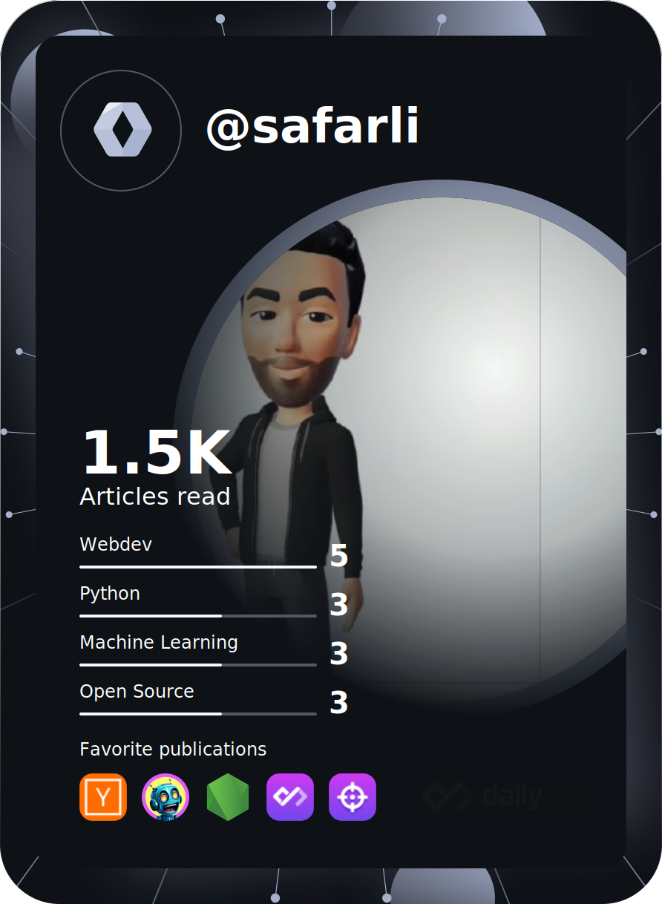

# :boy: Personal Github World

---

---

## :earth_asia: Public repositories on my Github profile primarily serve hobby and practice purposes. If you are looking for real-world projects, please do not hesitate to contact me.

---

<pre>
 ____             __            _ _     ____          _ _   _           _     
| __ ) ___  __ _ / _| __ _ _ __| (_)   / __ \    __ _(_) |_| |__  _   _| |__  
|  _ \/ __|/ _` | |_ / _` | '__| | |  / / _` |  / _` | | __| '_ \| | | | '_ \ 
| |_) \__ \ (_| |  _| (_| | |  | | | | | (_| | | (_| | | |_| | | | |_| | |_) |
|____/|___/\__,_|_|  \__,_|_|  |_|_|  \ \__,_|  \__, |_|\__|_| |_|\__,_|_.__/ 
                                       \____/   |___/                                                                      
</pre>

:computer: Dealing with Computers, since 2004  
:shield: :octopus: :dolphin:

---

## Currently Using

## I've knowledge of
<table><tr><td valign="top" width="33%">

### Frontend

  
  
  
  
  
  
  
  
  
  
  
  
  
  
  
  
  
  
  
  

</td><td valign="top" width="33%">

### Backend  

  
  
  
  
  
  
  
  
  
  
  
  
  
  
  
  
  

</td><td valign="top" width="33%">

### DevOps  

  
  
  
  
  
  
  
  
  
  
  
  
  
  
  
  
  
  
  
  
  

</td></tr></table>  

   

## Statistics

## My daily.dev DevCard :D

---

